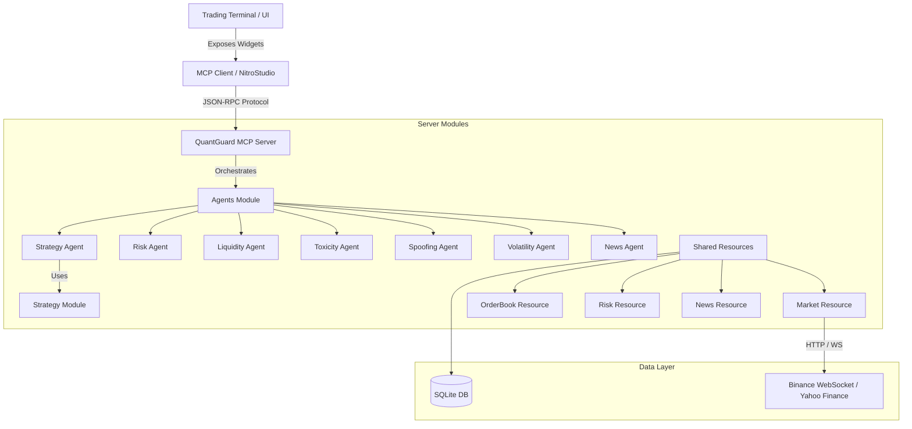
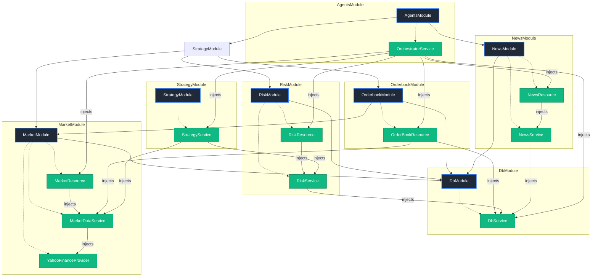
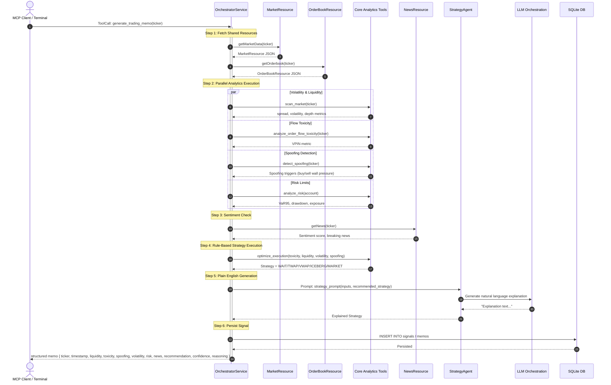
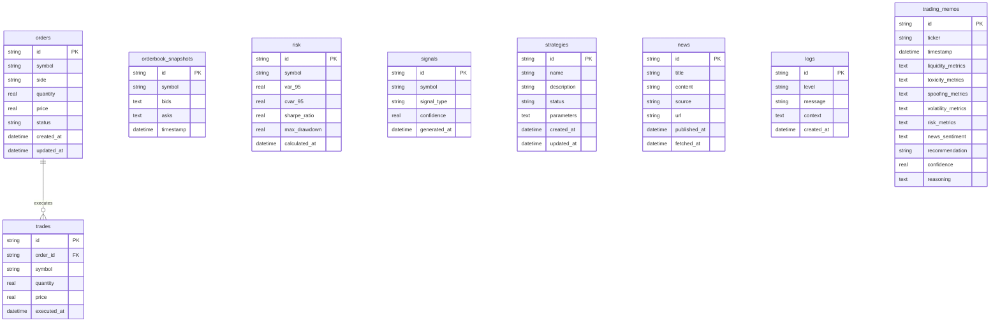
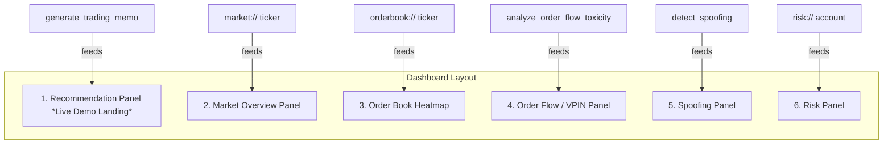

# QuantGuard MCP — Low-Level Design (LLD)

This document specifies the technical design, module architecture, database schemas, and decision logic for **QuantGuard MCP**, a multi-agent trading safety and execution risk platform.

---

## 1. System Architecture



---

## 2. Module & Dependency Injection (DI) Diagram

Every block below represents a NitroStack module (`@Module`), showing the injected services and modules.



---

## 3. Data Flow / Sequence Diagram

The sequence diagram below shows the flow when a client requests trading safety validation.



---

## 4. Tool & Resource Contract Table

| Primitive Type | URI / Tool Name | Input Schema (Zod) | Output Schema (Zod) |
| :--- | :--- | :--- | :--- |
| **Resource** | `market://{ticker}` | N/A (URI param: `ticker`) | `MarketResourceSchema`: currentPrice, ohlc, vwap, spread, volume, marketDepth, timestamp |
| **Resource** | `orderbook://{ticker}` | N/A (URI param: `ticker`) | `OrderBookResourceSchema`: bidLevels[], askLevels[], marketDepth, orderImbalance, liquidityScore, timestamp |
| **Resource** | `risk://{account}` | N/A (URI param: `account`) | `RiskResourceSchema`: currentExposure, pnl, var95, var99, expectedShortfall, maxDrawdown, leverage, suggestedMaxPositionSize, timestamp |
| **Resource** | `news://{ticker}` | N/A (URI param: `ticker`) | `NewsResourceSchema`: economicCalendar[], breakingNews[], sentimentScore, sentimentBreakdown, timestamp |
| **Tool** | `scan_market` | `ticker: string` | `price: number, spread: number, volatility: number, liquidityScore: number, timestamp: number` |
| **Tool** | `analyze_order_flow_toxicity` | `ticker: string, bucketSize?: number` | `vpin: number, toxicityStatus: 'LOW'\|'MEDIUM'\|'HIGH', timestamp: number` |
| **Tool** | `detect_spoofing` | `ticker: string` | `spoofingDetected: boolean, direction: 'BUY'\|'SELL'\|'NONE', spoofingDetails: string, timestamp: number` |
| **Tool** | `analyze_liquidity` | `ticker: string, orderSize?: number` | `liquidityScore: number, estimatedSlippagePercent: number, depthSummary: string, timestamp: number` |
| **Tool** | `optimize_execution` | `vpin: number, spread: number, volatility: number, spoofingDetected: boolean` | `recommendedStrategy: 'WAIT'\|'TWAP'\|'VWAP'\|'ICEBERG'\|'MARKET', confidence: number, reasoning: string` |
| **Tool** | `analyze_risk` | `account: string, positionTicker: string, proposedSize: number` | `var95: number, expectedShortfall: number, portfolioDrawdown: number, riskApproved: boolean, comments: string` |
| **Tool** | `backtest_strategy` | `strategy: 'TWAP'\|'VWAP'\|'MARKET', ticker: string, days?: number` | `sharpeRatio: number, totalReturn: number, maxDrawdown: number, winRate: number, tradesCount: number` |
| **Tool** | `generate_trading_memo` | `ticker: string, account: string` | `ticker: string, timestamp: number, recommendation: string, confidence: number, reasoning: string, metrics: object` |

---

## 5. Database Schema (ERD)



---

## 6. Decision Logic Table for `optimize_execution`

The logic in `optimize_execution` is strictly deterministic. The following table specifies the execution rules:

| Rule ID | Toxicity (VPIN) | Spread (bps) | Volatility (daily std dev) | Spoofing Detected | Recommended Strategy | Rationale / Rule Description |
| :--- | :--- | :--- | :--- | :--- | :--- | :--- |
| **R1** | Any | Any | Any | **True** | `WAIT` | **Spoofing Alert**: Large manipulative orders present. High risk of adverse selection. |
| **R2** | `> 0.45` | Any | Any | Any | `WAIT` | **Toxic Order Flow**: VPIN exceeds threshold. Adverse selection risk high. |
| **R3** | `> 0.35` | Any | Any | Any | `TWAP` | **Mild Toxicity**: Slow execution over time to minimize routing to informed counterparties. |
| **R4** | Any | `> 10` | Any | Any | `ICEBERG` | **Illiquid Book**: Large spreads mean crossing the book is expensive. Slice orders to rest inside the book. |
| **R5** | Any | Any | `> 0.03` | Any | `TWAP` | **Abnormal Volatility**: High market standard deviation. Smooth volatility exposure. |
| **R6** | `< 0.30` | `< 3` | `< 0.01` | **False** | `MARKET` | **Safe Liquid Market**: Low toxicity, tight spread, low volatility. Immediate execution. |
| **R7** | Default | Default | Default | **False** | `VWAP` | **Standard Liquid Market**: Balanced metrics. Execute inline with historical volume profiles. |

---

## 7. Dashboard Wireframe Flow

The UI consists of 6 presentation panels. The entry point of the live demo lands on the **Recommendation Panel**.



---

## 8. Agent Prompt Templates

These prompts will be registered using `@Prompt` decorators on class methods.

### 8.1. RiskAgent Prompt
```
Name: risk_agent_prompt
Description: Prompt for analyzing exposure, drawdowns, and Value at Risk (VaR) compliance.

Template:
You are the institutional Risk Agent of a quantitative trading desk.
Analyze the following account risk parameters:
- Total Notional Exposure: ${exposure}
- Unrealized PnL: ${pnl}
- Value at Risk (VaR 95%): ${var95}
- Portfolio Max Drawdown: ${maxDrawdown}
- Current Account Leverage: ${leverage}
- Suggested Position size limit: ${suggestedMaxPositionSize}

Determine whether the current risk levels are SAFE, WARNING, or CRITICAL. Provide a concise, action-oriented report outlining any violations of risk limits.
```

### 8.2. LiquidityAgent Prompt
```
Name: liquidity_agent_prompt
Description: Prompt for assessing depth, bid-ask spread, and slippage profiles.

Template:
You are the Liquidity Agent for the execution desk.
Evaluate these current market liquidity metrics:
- Bid-Ask Spread: ${spread} bps
- Order Book Imbalance: ${orderImbalance}
- Liquidity Score (0-100): ${liquidityScore}
- Expected Slippage (for normal order): ${slippage}%

Analyze the order book depth and describe the immediate market impact of trading. Focus on execution slippage and depth exhaustion.
```

### 8.3. ToxicityAgent Prompt
```
Name: toxicity_agent_prompt
Description: Prompt for evaluating order flow toxicity and VPIN.

Template:
You are the Order Flow Toxicity Agent.
Evaluate the current Volume-Synchronized Probability of Toxicity (VPIN):
- VPIN: ${vpin}
- Status: ${toxicityStatus}

Analyze whether informed traders (toxic flow) dominate the order flow. Explain if entering market orders is structurally safe, or if market makers are likely to pull liquidity.
```

### 8.4. SpoofingAgent Prompt
```
Name: spoofing_agent_prompt
Description: Prompt for identifying market manipulation, spoof walls, and fake liquidity.

Template:
You are the Spoofing and Order Book Manipulation Detection Agent.
Review the following order book anomalies:
- Spoofing Detected: ${spoofingDetected}
- Direction: ${direction}
- Details: ${spoofingDetails}

Provide an analysis of order book manipulation. Explain if large buy or sell walls are resting artificially to force prices up or down, and describe the risk of executing against this artificial price pressure.
```

### 8.5. VolatilityAgent Prompt
```
Name: volatility_agent_prompt
Description: Prompt for evaluating short-term price variance and realized volatility.

Template:
You are the Volatility Agent.
Review current price volatility metrics:
- Realized Volatility: ${volatility}
- Historical daily standard deviation: ${dailyStdDev}

Assess whether volatility is abnormal. Explain the implications of this volatility on slippage variance and execution timing.
```

### 8.6. NewsAgent Prompt
```
Name: news_agent_prompt
Description: Prompt for summarizing economic events and sentiment scores.

Template:
You are the Macro News Sentiment Agent.
Summarize the sentiment and potential impact of the following news headlines and calendar events:
- sentimentScore: ${sentimentScore} (scale -1 to +1)
- Sentiment Breakdown: ${sentimentBreakdown}
- Economic Calendar: ${economicCalendar}
- Breaking News Headlines: ${breakingNews}

Evaluate whether news flow presents an imminent tail-risk or event-risk.
```

### 8.7. StrategyAgent Prompt
```
Name: strategy_agent_prompt
Description: Prompt for synthesizing all agent reports and generating execution strategy memos.

Template:
You are the Chief Strategy Agent of the trading desk.
Your desk requires an execution recommendation based on the combined reports of the specialist agents:
- Volatility: ${volatilityReport}
- Liquidity: ${liquidityReport}
- Toxicity: ${toxicityReport}
- Spoofing: ${spoofingReport}
- Risk: ${riskReport}
- News Sentiment: ${newsReport}

The deterministic execution engine has selected:
RECOMMENDED STRATEGY: ${recommendedStrategy} (Confidence: ${confidence})

Write a brief, plain-English executive summary (the "Trading Memo") explaining to the portfolio manager why this strategy is recommended. Do not override the decision. Justify it using the metrics provided.
```
