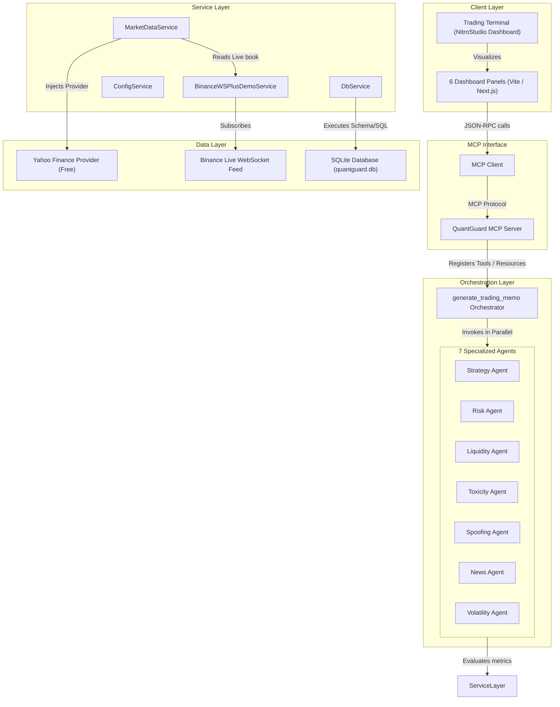
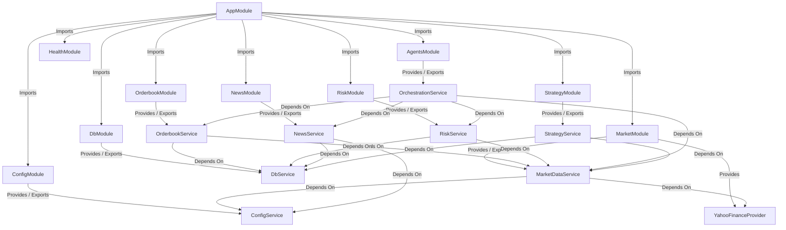
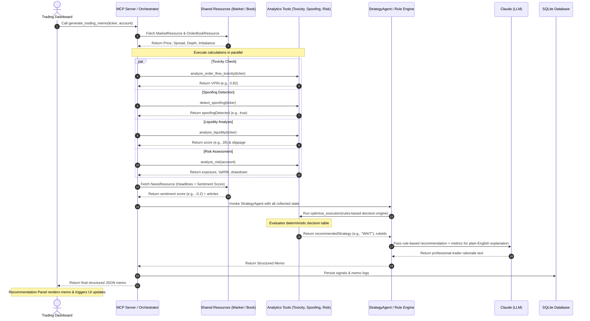
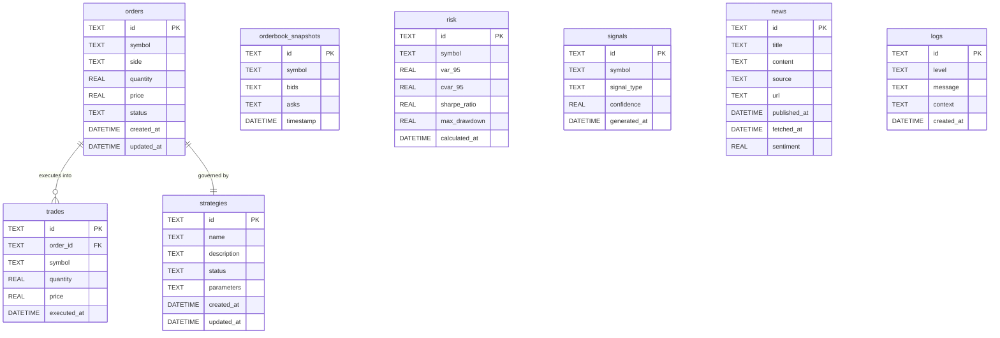

# Low-Level Design (LLD) — QuantGuard MCP

This Low-Level Design (LLD) document defines the architecture, components, data flow, API contracts, database schema, decision logic, and agent configurations for **QuantGuard MCP**, a microstructure-analytics and risk-aware execution platform built on the **NitroStack** framework.

---

## 1. System Architecture

The following diagram illustrates the flow from the client-facing UI (Trading Terminal/NitroStudio) down to the data providers and database storage:



---

## 2. Module DI Components

Every module in the codebase is a NitroStack `@Module` using NestJS-style Dependency Injection. The DI hierarchy and dependencies are structured as follows:



---

## 3. Data Flow Scenario: "Is this market safe to trade?"

When a client queries the system's safety and execution strategy recommendations, the orchestrator coordinates metrics collection, parallel analytics, deterministic rules calculation, and agent explanations:



---

## 4. Tool & Resource Contracts

### Shared Resources
Resources provide low-level data structures mapped to URI templates.

| Resource URI | Description | Input Schema | Output Schema |
|--------------|-------------|--------------|---------------|
| `market://{ticker}` | Real-time market metrics, spread, and candles. | `{ ticker: string }` | `MarketResourceSchema` |
| `orderbook://{ticker}` | Bid/ask levels, total depth, and order imbalance. | `{ ticker: string }` | `OrderBookResourceSchema` |
| `risk://{account}` | Portfolio exposure, VaR, Sharpe, and drawdown. | `{ account: string }` | `RiskResourceSchema` |
| `news://{ticker}` | Economic events, breaking news, and sentiment index. | `{ ticker: string }` | `NewsResourceSchema` |

### Core Analytics and Execution Tools
Tools perform actions and execute logic triggered by client requests or agent loops.

| Tool Name | Description | Input Schema (Zod) | Output Schema (Zod) |
|-----------|-------------|--------------------|---------------------|
| `scan_market` | Fetches base price, spread, volatility, and general health. | `ticker: string` | `price: number, spread: number, volatility: number, liquidityScore: number` |
| `analyze_order_flow_toxicity` | Computes VPIN (Volume-Synchronized Probability of Toxicity). | `ticker: string, buckets?: number` | `vpin: number, toxicityLevel: 'Low'\|'Medium'\|'High'` |
| `detect_spoofing` | Scans for large resting orders that appear and disappear. | `ticker: string, threshold?: number` | `spoofingDetected: boolean, signals: Array<{ price: number, side: string, size: number }>` |
| `analyze_liquidity` | Evaluates book depth and estimates slippage. | `ticker: string, orderSize: number` | `liquidityScore: number, estimatedSlippageBps: number` |
| `optimize_execution` | Deterministic decision table evaluator. **Rule-based only.** | `ticker: string, liquidityScore: number, toxicityScore: number, spoofingDetected: boolean, riskLevel: string` | `recommendedStrategy: 'WAIT'\|'TWAP'\|'VWAP'\|'ICEBERG'\|'MARKET', ruleDescription: string` |
| `analyze_risk` | Portfolio calculations: VaR95/99 and Expected Shortfall. | `account: string` | `var95: number, expectedShortfall: number, suggestedMaxPositionSize: number` |
| `backtest_strategy` | Simulates TWAP, VWAP, or Market orders on historical candles. | `ticker: string, strategy: 'TWAP'\|'VWAP'\|'MARKET', days?: number` | `sharpe: number, totalReturn: number, maxDrawdown: number, winRate: number` |
| `generate_trading_memo` | High-level orchestrator query summarizing market safety. | `ticker: string, account: string` | Full nested JSON schema containing ticker, timestamp, recommendations, confidence, and reasoning. |

---

## 5. Database Schema (ERD)

The SQLite database (`quantguard.db`) schema and relations:



---

## 6. Decision Logic Table for `optimize_execution`

The execution logic is entirely rule-based and auditable. The LLM **never** overrides these decisions:

| Condition # | Spoofing | Toxicity (VPIN) | Liquidity Score | Portfolio VaR Risk | Recommended Strategy | Rationale & Code Trigger |
|-------------|----------|-----------------|-----------------|--------------------|----------------------|--------------------------|
| 1 | **TRUE** | Any | Any | Any | **WAIT** | Spoofing detected in the order book. High price manipulation risk. |
| 2 | Any | **> 0.70 (High)**| Any | Any | **WAIT** | Order flow toxicity is extremely high (VPIN > 0.70). High risk of adverse selection. |
| 3 | FALSE | <= 0.70 | **< 30 (Low)** | Any | **TWAP** | Market is highly illiquid. Use Time-Weighted Average Price to split size. |
| 4 | FALSE | <= 0.70 | >= 30 | **High (> Limit)** | **ICEBERG** | Account exposure/VaR exceeds limits. Use Iceberg order to hide block size. |
| 5 | FALSE | **0.40 - 0.70** | >= 30 | Safe | **VWAP** | Moderate toxicity detected. Participate along volume profile to avoid impact. |
| 6 | FALSE | < 0.40 | **>= 70 (High)**| Safe | **MARKET** | Liquid and safe conditions. Immediate execution via Market Order. |
| 7 | Default | Default | Default | Default | **TWAP** | Default fallback for stable execution. |

---

## 7. Dashboard Wireframe Flow

The layout contains 6 primary widgets configured inside NitroStudio. The live demo prioritizes the **Recommendation Panel** as the landing view.

```mermaid
graph TD
    subgraph Dashboard UI Layout [Dashboard UI Layout]
        Widget1["1. Market Overview<br/>(scan_market Tool)"]
        Widget2["2. Order Book Heatmap<br/>(orderbook://{ticker} Resource)"]
        Widget3["3. Order Flow / VPIN<br/>(analyze_order_flow_toxicity Tool)"]
        Widget4["4. Spoofing Panel<br/>(detect_spoofing Tool)"]
        Widget5["5. Risk Panel<br/>(risk://{account} Resource)"]
        Widget6["6. Recommendation Panel<br/>(generate_trading_memo Tool)"]
    end

    DataService["BinanceWSPlusDemoService (Data Producer)"]
    DataService -->|Feeds real-time updates| Widget1
    DataService -->|Feeds bids/asks| Widget2
    DataService -->|Feeds trade prints| Widget3
    DataService -->|Feeds cancel events| Widget4
    
    Widget6 -->|Triggers orchestrator| Widget1 & Widget2 & Widget3 & Widget4 & Widget5
    Note over Widget6: Live Demo lands here. Auto-updates when synthetic spoof is injected.
```

---

## 8. Agent Prompt Templates

Each of the 7 agents is declared using NitroStack `@Prompt` decorators. These are their exact template definitions:

### 1. LiquidityAgent Prompt
```
You are the Liquidity Agent for QuantGuard.
Your task is to analyze order book depth, bid-ask spreads, and order sizes.
Analyze the following parameters:
- Bid-Ask Spread: {spread} bps
- Total Depth (Bids): {bidDepth} units
- Total Depth (Asks): {askDepth} units
- Imbalance Score: {orderImbalance} (-1 to 1)

Provide a detailed summary of depth and market thickness in quantitative terminology. Detail slippage risks for a standardized order of {orderSize} units.
```

### 2. ToxicityAgent Prompt
```
You are the Toxicity Agent for QuantGuard.
Your task is to evaluate adverse selection risk using the VPIN metric (Volume-Synchronized Probability of Toxicity).
Analyze the following parameters:
- VPIN Score: {vpin} (range 0 to 1)
- Toxicity Level: {toxicityLevel}

Explain whether informed traders are dominating order flow. Provide clear warnings if high toxicity will result in immediate adverse execution. Use terminology like "informed flow", "uninformed flow", and "adverse selection".
```

### 3. SpoofingAgent Prompt
```
You are the Spoofing Agent for QuantGuard.
Your task is to detect manipulative order book activity such as phantom buy/sell walls.
Analyze the following parameters:
- Spoofing Detected: {spoofingDetected}
- Recent Cancel Events: {cancelEvents}

Detail if there is a pattern of large orders appearing and disappearing rapidly within tight price windows. Highlight if these cancellations are correlated with price movements in the opposite direction.
```

### 4. VolatilityAgent Prompt
```
You are the Volatility Agent for QuantGuard.
Your task is to analyze price variance, range, and volatility spikes.
Analyze the following parameters:
- Realized Volatility: {realizedVolatility}
- High-Low Candle Range: {hlRange}
- Volatility Level: {volatilityLevel}

Explain if volatility is expanding or contracting, and how it impacts bid-ask spreads.
```

### 5. RiskAgent Prompt
```
You are the Risk Agent for QuantGuard.
Your task is to evaluate portfolio exposure, drawdown safety limits, and Value-at-Risk.
Analyze the following parameters:
- Account: {account}
- Current Exposure: {currentExposure}
- VaR (95%): {var95}
- CVaR (95% Expected Shortfall): {expectedShortfall}
- Max Drawdown: {maxDrawdown}
- Leverage: {leverage}

Advise on the safety of initiating new positions. Recommend maximum size based on current portfolio VaR limits.
```

### 6. NewsAgent Prompt
```
You are the News Agent for QuantGuard.
Your task is to assess macroeconomic event risk and headline sentiment.
Analyze the following parameters:
- News Sentiment Score: {sentimentScore} (-1 to 1)
- Breaking Headlines: {headlines}
- Upcoming Calendar Events: {calendar}

Explain how macro news or calendar events may impact market microstructure stability in the next 1-4 hours.
```

### 7. StrategyAgent Prompt
```
You are the Lead Strategy Agent for QuantGuard.
You compile the final Market Safety Memo.

You will receive the following parameters:
- Ticker: {ticker}
- Deterministic Strategy Decision: {recommendedStrategy} (This was calculated using our auditable rule-engine and CANNOT be changed!)
- Rule Rationale: {ruleDescription}
- VPIN Analysis: {toxicityExplanation}
- Spoofing Analysis: {spoofingExplanation}
- Liquidity Analysis: {liquidityExplanation}
- Volatility Analysis: {volatilityExplanation}
- Portfolio Risk Analysis: {riskExplanation}
- News Sentiment Analysis: {newsExplanation}

Draft an institutional-grade Executive Trading Memo. Your memo must be written in professional trading-desk jargon (e.g., "adverse selection", "order book depletion", "skewness", "illiquidity penalty").
Structure your memo exactly as follows:
1. Executive Recommendation (WAIT / TWAP / VWAP / ICEBERG / MARKET) in bold.
2. Confidence Score (0-100%).
3. Microstructure Assessment (Liquidity, Toxicity, Spoofing, Volatility).
4. Portfolio Constraints & Exposure Risk.
5. Execution Strategy Rationale (explaining why the chosen strategy is optimal given the conditions).

Keep the summary clear, professional, and free of vague stock-tipping predictions. Focus strictly on market microstructure and execution safety.
```
